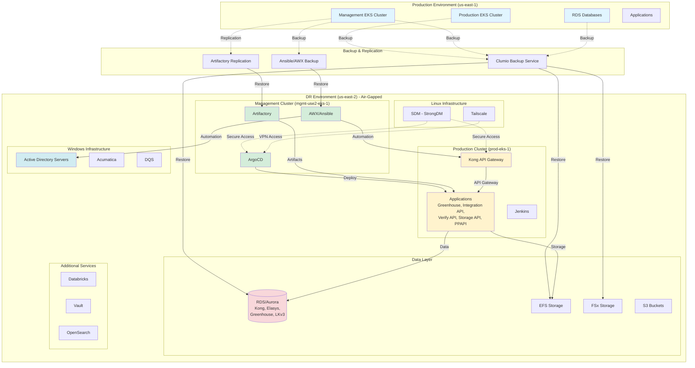
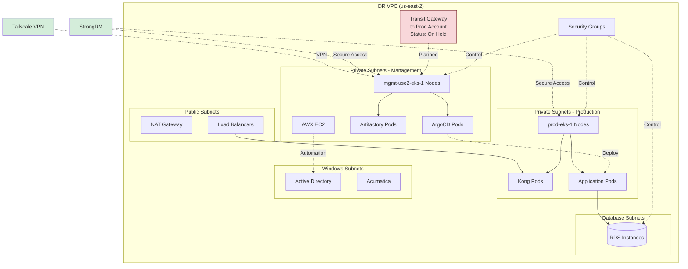
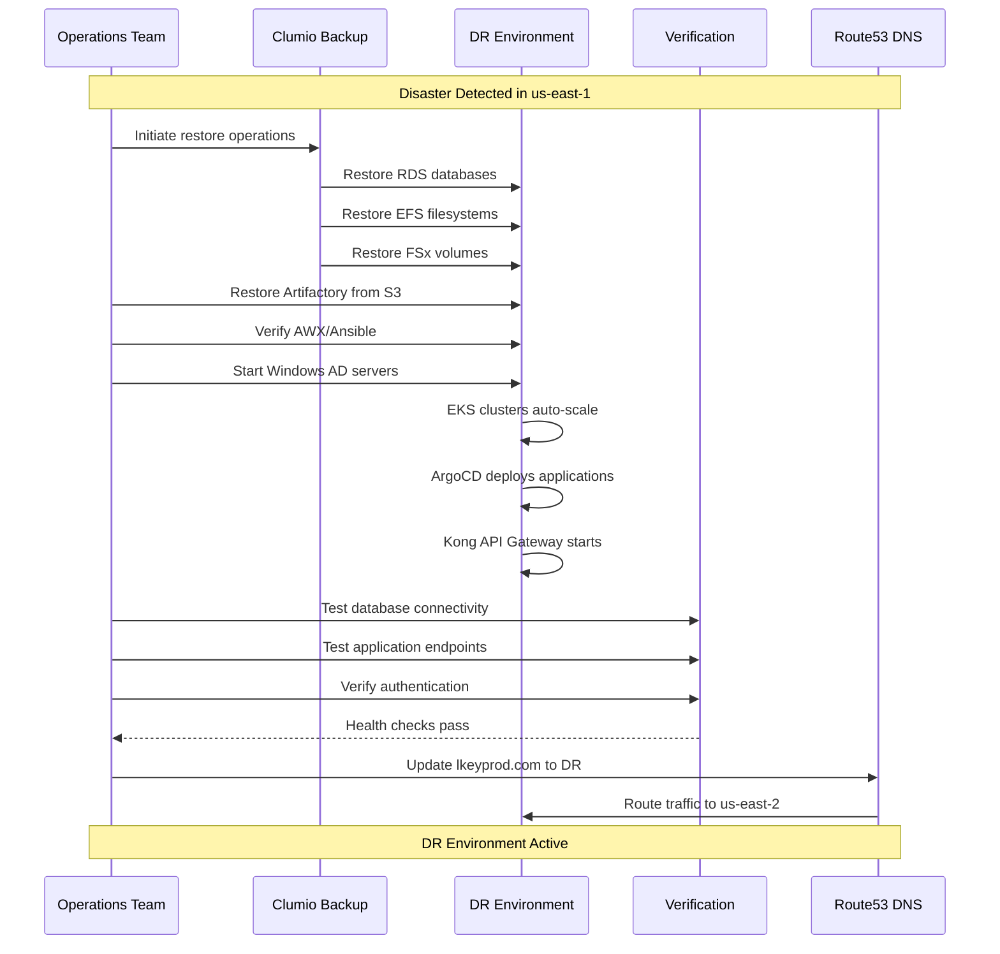

# AWS Disaster Recovery Environment

> Documentation and automation scripts for the AWS Disaster Recovery (DR) environment in us-east-2

## Table of Contents

- [Overview](#overview)
- [Architecture](#architecture)
- [Components](#components)
- [Quick Start](#quick-start)
- [Scripts](#scripts)
- [Current Status](#current-status)
- [RTO/RPO Objectives](#rtorpo-objectives)
- [Runbooks](#runbooks)
- [References](#references)

---

## Overview

### Purpose

Ensure business continuity by replicating critical applications and infrastructure in an air-gapped environment to support disaster recovery scenarios.

### Key Objectives

- **RTO (Recovery Time Objective):** Minimize downtime during failover to DR environment
- **RPO (Recovery Point Objective):** Minimize data loss through automated backups and replication
- **Security:** Maintain air-gapped isolation to prevent cascading failures
- **Automation:** Deploy infrastructure using Infrastructure as Code (Terraform)
- **Availability:** Ensure all critical applications are operational in DR

### Environment Summary

| Aspect | Details |
|--------|---------|
| **Primary Region** | us-east-1 (Production) |
| **DR Region** | us-east-2 (Disaster Recovery) |
| **Production Account** | AWS Account: 128765541338 |
| **DR Account** | AWS Account: 051826732093 |
| **Isolation** | Air-gapped from production |
| **Backup Solution** | Clumio (RDS, EFS, FSx) |
| **IaC** | Terraform |
| **Production Access** | StrongDM (SDM) |
| **DR Access** | Tailscale VPN |

---

## Architecture

### High-Level DR Architecture



### Network Architecture



### Failover Process Flow



---

## Components

### Applications

Critical applications deployed in DR:

- **Greenhouse** - Recruiting and applicant tracking
- **Integration API** - Core integration services
- **Verify API** - Verification services
- **Storage API** - Document and file management
- **PPAPI** - Payment processing API

### AWS Infrastructure

#### EKS Clusters

##### Management Cluster (`mgmt-use2-eks-1`)

**Purpose:** Hosts platform management tools and CI/CD infrastructure

**Components:**
- **ArgoCD** - GitOps continuous delivery (Terraform-managed)
- **Artifactory** - Artifact repository (Docker, Helm, Maven, NPM, PyPI, NuGet)
- **AWX/Ansible** - Configuration management and automation

**Access:**
- IAM-based cluster access
- Tailscale VPN + StrongDM for secure shell access
- See [docs/DR-EKS-Cluster-Access.md](docs/DR-EKS-Cluster-Access.md)

**Known Issues:**
- Initial deployment had access issues (resolved via IAM configuration)
- Autoscaling groups required tuning

##### Production Cluster (`prod-eks-1`)

**Purpose:** Hosts production applications and services

**Components:**
- **Kong API Gateway** - API gateway and ingress
- **Application Pods** - All production workloads
- **Jenkins** - CI/CD pipelines (TBD)

#### VPC & Networking

- **VPC Configuration:** Isolated VPC in us-east-2
- **Security Groups:** Restrictive security group policies
- **Transit Gateway:** Connection to active prod account (on hold)
- **DNS:** Route53 configuration for lkeyprod.com domain

#### Databases (RDS/Aurora)

Restored from Clumio backups:
- **Kong Database** - Kong configuration and state
- **Elasys** - Elasticsearch data
- **Greenhouse Database** - Recruiting data
- **LKv3 Database** - Core application database

#### Storage

| Type | Purpose | Backup Method | Status |
|------|---------|---------------|--------|
| **EFS** | Shared file storage | Clumio | Testing (Apr 15, 2025) |
| **FSx** | Windows file storage | Clumio | Testing (Apr 8, 2025) |
| **EBS** | Block storage for OpenSearch, MSSQL | Snapshots | Active |
| **S3** | Databricks, Backups | Cross-region replication | Active |

#### EC2 Instances

##### Windows Servers
- **Active Directory** - Domain controller (restored from Clumio)
- **Acumatica** - ERP system
- **DQS** - Data Quality Services

##### Linux Servers
- **AWX (Ansible)** - Standalone EC2 + Minikube deployment (not in EKS)
- **StrongDM** - Secure access management (Production access)
- **Tailscale** - VPN connectivity (DR access)

#### Additional Services

- **Databricks** - Data analytics platform
- **Vault** - Secrets management (deployment via Ansible)
- **OpenSearch** - Log aggregation and search

### Infrastructure as Code

All infrastructure is managed via Terraform/Terragrunt. See **[Terraform Infrastructure Documentation](docs/DR-Terraform-Infrastructure.md)** for complete details.

**Repository Location:** `/home/mmasseo/gitstuff/terraform/lk/aws/us-east-2/`

**Key Infrastructure:**

```
lk/aws/us-east-2/
├── mgmt/                          # Management environment (172.20.0.0/16)
│   ├── vpc/                       # VPC: use2-mgmt-vpc-shared
│   ├── jfrog-resources/           # Artifactory (RDS db.r5.xlarge)
│   ├── domain-controllers/        # Active Directory
│   ├── hosted-dns-zones/          # lkeymgmtdr.com
│   ├── acm-certificates/          # SSL certificates
│   ├── sdm-gateway/               # StrongDM gateway
│   └── ...                        # KMS, IAM, Security Groups, etc.
└── prod/                          # Production environment (172.18.0.0/16)
    ├── vpc/                       # VPC: use2-prod-vpc-prod
    ├── vault-integrated-storage/  # HashiCorp Vault (3-node cluster)
    ├── acumatica/                 # Acumatica ERP
    ├── dna-dqs/                   # Data Quality Services
    ├── fsx-file-share/            # FSx Windows storage
    ├── elasys/                    # Elasticsearch
    ├── hosted-dns-zones/          # lkeyproddr.com
    └── ...                        # 30+ other services
```

**Terraform Configuration:**
- **AWS Profile:** `production_dr`
- **State Backend:** S3 (separate buckets for mgmt and prod)
- **State Lock:** DynamoDB
- **Deployment Tool:** Terragrunt

---

## Quick Start

> **Quick Reference:** For essential DR information during operations, see [DR Quick Reference Guide](docs/DR-Quick-Reference.md)

### AWS Account Access

**Production Account (128765541338):**
- Access via **StrongDM (SDM)**
- Region: us-east-1
- Used for production workloads

**DR Account (051826732093):**
- Access via **Tailscale VPN**
- Region: us-east-2
- Air-gapped from production

### Prerequisites

1. **Tailscale VPN** - Required for DR access:
   ```bash
   # Verify Tailscale connection
   tailscale status

   # Connect to DR network
   tailscale up
   ```

2. **AWS CLI** configured with DR profile:
   ```bash
   aws configure --profile dr
   # AWS Access Key ID: [your-dr-credentials]
   # AWS Secret Access Key: [your-dr-secret]
   # Default region: us-east-2

   export AWS_PROFILE=dr

   # Verify access to DR account
   aws sts get-caller-identity
   # Should show Account: 051826732093
   ```

3. **kubectl** installed and configured:
   ```bash
   # Add DR clusters to kubeconfig
   aws eks update-kubeconfig --name mgmt-use2-eks-1 --region us-east-2 --profile dr
   aws eks update-kubeconfig --name prod-eks-1 --region us-east-2 --profile dr
   ```

### Verify Cluster Access

```bash
# List available contexts
kubectl config get-contexts

# Switch to management cluster
kubectl config use-context arn:aws:eks:us-east-2:051826732093:cluster/mgmt-use2-eks-1

# Verify access
kubectl get nodes
kubectl get pods -A
```

For detailed cluster access instructions, see [docs/DR-EKS-Cluster-Access.md](docs/DR-EKS-Cluster-Access.md).

---

## Scripts

### Artifactory Cache Management

After restoring Artifactory from backup, caches and indexes may need to be cleared and regenerated.

#### `clear-helm-indexes.sh`

Clears caches and regenerates indexes for all Helm repositories.

**Usage:**
```bash
export JFROGAUTH="username:password"  # or "username:api-key"
./clear-helm-indexes.sh
```

**What it does:**
- Finds all Helm repositories (local, remote, virtual)
- Clears virtual repository caches (forces re-aggregation)
- Zaps remote repository caches (forces re-fetch from upstream)
- Deletes old `index.yaml` files from local repositories
- Regenerates `index.yaml` files via Artifactory API

**When to use:**
- After restoring Artifactory from backup
- When Helm chart queries return 500 errors
- When charts are not appearing in virtual repositories

#### `clear-all-artifactory-caches.sh`

Comprehensive cache cleanup and reindexing for all repository types.

**Usage:**
```bash
export JFROGAUTH="username:password"  # or "username:api-key"
./clear-all-artifactory-caches.sh
```

**What it does:**
- Processes ALL repository types (Helm, Maven, NPM, Docker, PyPI, NuGet)
- Clears caches based on repository type (virtual/remote/local)
- Deletes old index/metadata files
- Regenerates indexes using package-specific APIs:
  - **Helm:** Delete `index.yaml` + reindex
  - **Maven:** Recalculate metadata
  - **NPM:** Reindex packages
  - **PyPI:** Reindex packages
  - **NuGet:** Recalculate metadata
- Reports success/failure with HTTP status codes

**When to use:**
- After full Artifactory restoration in DR
- When multiple repository types are having issues
- As part of post-DR-activation procedures

**Post-execution verification:**
```bash
# Recalculate storage info
curl -X POST -u $JFROGAUTH https://artifactory.lkeymgmtdr.com/artifactory/api/storageinfo/calculate

# Check logs for errors
kubectl logs -n <namespace> artifactory-0 --tail=100

# Test Helm repository
curl -s -k -u $JFROGAUTH https://artifactory.lkeymgmtdr.com/artifactory/helm/index.yaml | head -20
```

### Common Issues

See [artifactory-xray-cache-fix.md](artifactory-xray-cache-fix.md) for troubleshooting Xray integration issues after backup restoration.

---

## Current Status

### Component Status Matrix

| Service | Status | Last Updated | Notes | Owner |
|---------|--------|--------------|-------|-------|
| **ArgoCD** | ✅ Deployed | Apr 11, 2025 | Testing ongoing | Augusto Peralta |
| **EKS Management** | ✅ Working | Mar 24, 2025 | kubectl via Tailscale + SDM | Johann Ramos |
| **Artifactory** | 🟡 In Progress | Apr 15, 2025 | Pods running, SSO config needed | Augusto Peralta |
| **Active Directory** | 🟡 In Progress | Apr 15, 2025 | Restored from Clumio | Fernando Eickhoff, Mark Fahey |
| **Kong API Gateway** | 🔵 Planning | Apr 15, 2025 | DB + pod deployment, license review | TBD |
| **Vault** | 🔵 Planning | Apr 15, 2025 | Ansible-based deployment | Fernando Eickhoff |
| **DNS (lkeyprod.com)** | 🔍 Investigating | Apr 15, 2025 | Route53 configuration for DR | Mike Masseo |
| **EFS** | 🧪 Testing | Apr 15, 2025 | Restored from airgapped vault | Mike Masseo |
| **FSx** | 🧪 Testing | Apr 15, 2025 | Backup verified Apr 8, 2025 | Mark Fahey, Mike Masseo |
| **AWX/Ansible** | ✅ Deployed | Mar 24, 2025 | EC2 + MiniKube, routing issues | Johann Ramos |
| **Transit Gateway** | ⏸️ On Hold | Apr 1, 2025 | Attempting to avoid dependency | Mike Masseo |
| **Jenkins (MGMT)** | ⏳ TBD | - | Not yet planned | - |
| **Jenkins (PROD)** | ⏳ TBD | - | Not yet planned | - |

**Legend:**
- ✅ Deployed/Working
- 🟡 In Progress
- 🔵 Planning
- 🔍 Investigating
- 🧪 Testing
- ⏸️ On Hold
- ⏳ To Be Determined

---

## RTO/RPO Objectives

### Recovery Time Objective (RTO)

Target time to restore operations in DR environment:

| Component | Target RTO | Notes |
|-----------|------------|-------|
| **EKS Clusters** | 1-2 hours | Clusters pre-provisioned, requires scaling |
| **Databases (RDS)** | 2-4 hours | Clumio restore time dependent on size |
| **Storage (EFS/FSx)** | 2-4 hours | Clumio restore time dependent on size |
| **Artifactory** | 4-6 hours | S3 restore + cache regeneration |
| **Applications** | 2-4 hours | ArgoCD automated deployment after DB restore |
| **DNS Cutover** | 5-10 minutes | Route53 TTL-dependent |
| **Overall RTO** | **6-8 hours** | End-to-end recovery time |

### Recovery Point Objective (RPO)

Maximum acceptable data loss:

| Data Type | Target RPO | Backup Frequency |
|-----------|------------|------------------|
| **Databases** | 1 hour | Continuous backup via Clumio |
| **EFS/FSx** | 4 hours | Incremental backup via Clumio |
| **Artifactory** | 24 hours | Daily S3 sync |
| **Configuration** | N/A | Git-based (no data loss) |

---

## Runbooks

### DR Activation Procedure

#### Phase 1: Assessment (15-30 minutes)

1. **Confirm disaster scope:**
   - Determine if entire us-east-1 region is unavailable
   - Verify which services are impacted
   - Establish incident response team

2. **Communicate status:**
   - Notify stakeholders of DR activation
   - Update status page
   - Establish communication channels

#### Phase 2: Infrastructure Restore (2-4 hours)

1. **Restore databases from Clumio:**
   ```bash
   # Login to Clumio console
   # Select us-east-1 backup snapshots
   # Restore to us-east-2 RDS instances
   # Note: This can be done in parallel for all databases
   ```

2. **Restore storage from Clumio:**
   ```bash
   # Restore EFS filesystems
   # Restore FSx volumes
   # Verify mount targets in us-east-2
   ```

3. **Restore Artifactory from S3:**
   ```bash
   # Restore Artifactory data from S3 backup
   # Run cache cleanup scripts
   export JFROGAUTH="username:api-key"
   ./clear-all-artifactory-caches.sh
   ```

4. **Start Windows infrastructure:**
   ```bash
   # Start Active Directory EC2 instances
   # Verify AD replication
   # Start Acumatica and DQS instances
   ```

#### Phase 3: Application Deployment (1-2 hours)

1. **Verify EKS clusters:**
   ```bash
   export AWS_PROFILE=dr
   kubectl config use-context arn:aws:eks:us-east-2:051826732093:cluster/mgmt-use2-eks-1
   kubectl get nodes
   kubectl get pods -A
   ```

2. **Deploy applications via ArgoCD:**
   ```bash
   # Access ArgoCD UI
   # Sync all applications
   # Monitor deployment status
   kubectl get applications -n argocd
   ```

3. **Configure Kong API Gateway:**
   ```bash
   # Verify Kong database connectivity
   # Update Kong configuration for DR endpoints
   # Test Kong routes
   ```

#### Phase 4: Verification (30-60 minutes)

1. **Database connectivity tests:**
   ```bash
   # Test connection to each RDS instance
   # Verify data integrity
   # Check replication lag (if applicable)
   ```

2. **Application health checks:**
   ```bash
   # Test each application endpoint
   # Verify API responses
   # Check application logs
   ```

3. **Integration tests:**
   ```bash
   # Test critical user workflows
   # Verify authentication/authorization
   # Test inter-service communication
   ```

#### Phase 5: DNS Cutover (5-10 minutes)

**Reference:** See [Domain and Service Inventory](docs/DR-Domain-Service-Inventory.md) for detailed DNS cutover procedures.

1. **Update Route53 DNS records:**
   ```bash
   # Update lkeyprod.com A records to point to DR load balancers
   # Reduce TTL to 60 seconds for quick rollback if needed
   aws route53 change-resource-record-sets --hosted-zone-id <zone-id> \
     --change-batch file://dr-dns-change.json
   ```

2. **Monitor traffic:**
   ```bash
   # Watch access logs
   # Monitor error rates
   # Verify traffic is flowing to DR
   ```

3. **Verify services:**
   ```bash
   # Test public endpoints
   # Verify SSL certificates
   # Check monitoring dashboards
   ```

#### Phase 6: Post-Activation (Ongoing)

1. **Monitor system health**
2. **Document issues and resolutions**
3. **Plan for return to us-east-1 (when available)**

### DR Deactivation / Return to Production

When us-east-1 is available again:

1. **Assess production environment readiness**
2. **Sync data from DR to production** (identify changes made during DR)
3. **Update DNS to point back to us-east-1**
4. **Scale down DR environment to standby state**
5. **Conduct post-incident review**

---

## Testing and Validation

**Issue Tracking:** All issues encountered during DR testing should be logged in [DR Testing Issues and Resolutions Log](docs/DR-Testing-Issues-Log.md).

### Regular DR Tests

**Recommended schedule:**
- **Quarterly:** Full DR activation test
- **Monthly:** Partial failover test (non-production applications)
- **Weekly:** Backup restoration verification

### Test Checklist

- [ ] Verify Clumio backups are successful
- [ ] Test database restoration from Clumio
- [ ] Test EFS/FSx restoration from Clumio
- [ ] Verify EKS cluster access
- [ ] Test ArgoCD application deployment
- [ ] Verify Artifactory functionality
- [ ] Test Kong API Gateway routing
- [ ] Verify Windows AD authentication
- [ ] Test application endpoints
- [ ] Measure actual RTO/RPO achieved
- [ ] Document issues and improvements

---

## References

### Documentation

- **[Quick Reference Guide](docs/DR-Quick-Reference.md)** - Essential info for DR operations
- [EKS Cluster Status](docs/DR-EKS-Cluster-Status.md) - Real-time cluster state and configuration
- [Terraform Infrastructure](docs/DR-Terraform-Infrastructure.md) - Complete IaC documentation
- [EKS Cluster Access Guide](docs/DR-EKS-Cluster-Access.md)
- [Domain and Service Inventory](docs/DR-Domain-Service-Inventory.md)
- [Testing Issues and Resolutions Log](docs/DR-Testing-Issues-Log.md)
- [Artifactory Xray Cache Fix](artifactory-xray-cache-fix.md)

### External Resources

- [AWS EKS Best Practices](https://aws.github.io/aws-eks-best-practices/)
- [Clumio Documentation](https://docs.clumio.com/)
- [ArgoCD Documentation](https://argo-cd.readthedocs.io/)
- [JFrog Artifactory REST API](https://www.jfrog.com/confluence/display/JFROG/Artifactory+REST+API)
- [Kong Gateway Documentation](https://docs.konghq.com/)

### Internal Resources

- Confluence: [DR Project Tracker](https://confluence.yourcompany.com/dr-project)
- Jira: [DR Action Items](https://jira.yourcompany.com/projects/DR)
- Terraform: [Infrastructure Repository](https://github.com/yourorg/terraform-dr)

---

## Contributing

### Adding Documentation

1. Create documentation in the `docs/` directory
2. Use descriptive filenames (e.g., `DR-Service-Name-Guide.md`)
3. Update this README with links to new documentation

### Adding Scripts

1. Add scripts to the root directory
2. Include usage instructions in script header
3. Document in the [Scripts](#scripts) section
4. Make scripts executable: `chmod +x script-name.sh`

### Documentation Standards

- Use clear, concise language
- Include code examples where applicable
- Document prerequisites and dependencies
- Include troubleshooting sections
- Keep status information up to date

---

## Support

For questions or issues:

- **Platform Team:** platform-team@yourcompany.com
- **On-Call:** Refer to PagerDuty rotation
- **Emergency:** Follow incident response procedures

---

## License

Internal use only. Confidential and proprietary.

---

**Last Updated:** 2025-10-27
**Maintained By:** Platform Engineering Team
