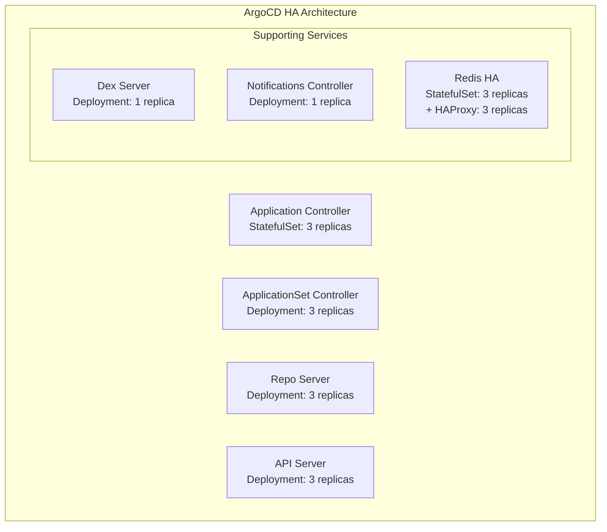
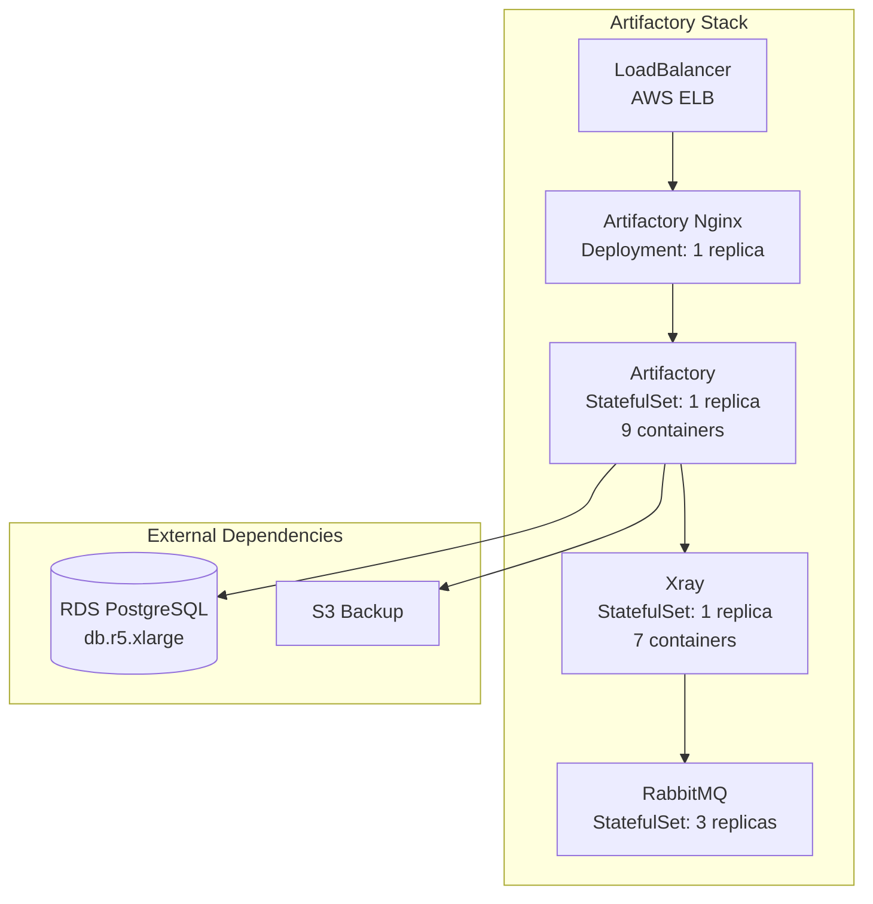

# DR EKS Cluster Status and Configuration

> Real-time status and configuration of the DR management EKS cluster (mgmt-use2-eks-1)

## Table of Contents

- [Overview](#overview)
- [Cluster Status](#cluster-status)
- [Deployed Applications](#deployed-applications)
- [Storage Configuration](#storage-configuration)
- [Network Configuration](#network-configuration)
- [Scaling Strategy](#scaling-strategy)
- [Activation Procedure](#activation-procedure)

---

## Overview

### Cluster Information

| Property | Value |
|----------|-------|
| **Cluster Name** | mgmt-use2-eks-1 |
| **Region** | us-east-2 |
| **AWS Account** | 051826732093 |
| **Context** | `arn:aws:eks:us-east-2:051826732093:cluster/mgmt-use2-eks-1` |
| **Created** | ~3 days ago |
| **Current State** | Scaled to zero (cost savings) |

### Access

```bash
# Switch to cluster
kubectx arn:aws:eks:us-east-2:051826732093:cluster/mgmt-use2-eks-1

# Verify connection
kubectl get nodes
```

---

## Cluster Status

### Current State (As of last check)

```
Nodes: 0 (Scaled down for cost savings)
Status: All pods in Pending state (waiting for nodes)
Purpose: Only runs during DR tests and actual disaster recovery
```

### Operational Philosophy

**Cost Optimization Strategy:**
- Cluster scaled to **zero nodes** when not in use
- All application configurations remain deployed
- Persistent volumes remain attached and ready
- LoadBalancers and DNS configurations stay active

**When Cluster Runs:**
1. **Monthly DR testing** (scaled up for test duration)
2. **Actual disaster recovery events** (scaled up for full operation)

This approach saves significant costs while maintaining infrastructure-as-code and rapid activation capability.

---

## Deployed Applications

### Namespaces

```bash
kubectl get namespaces
```

| Namespace | Purpose | Age |
|-----------|---------|-----|
| **argocd** | GitOps continuous delivery | 2d22h |
| **artifactory** | Artifact repository (Artifactory + Xray) | 2d22h |
| **kube-management** | Cluster management tools | 2d22h |
| **kube-system** | Kubernetes system components | 3d1h |
| **monitoring** | Observability (OpenTelemetry) | 2d21h |
| **default** | Default namespace | 3d1h |

### ArgoCD (GitOps Platform)

**Namespace:** `argocd`

#### Deployments & StatefulSets



**Components:**

| Component | Type | Replicas | Status |
|-----------|------|----------|--------|
| **Application Controller** | StatefulSet | 0/3 | Pending |
| **ApplicationSet Controller** | Deployment | 0/3 | Pending |
| **Repo Server** | Deployment | 0/3 | Pending |
| **API Server** | Deployment | 0/3 | Pending |
| **Dex Server** | Deployment | 0/1 | Pending |
| **Notifications Controller** | Deployment | 0/1 | Pending |
| **Redis HA Server** | StatefulSet | 0/3 | Pending |
| **Redis HA Proxy** | Deployment | 0/3 | Pending |

**Services:**

```bash
# ArgoCD Server (NodePort for internal ALB)
mgmt-argocd-server   NodePort   10.100.125.13   <none>   80:30080/TCP,443:30443/TCP

# Internal services
mgmt-argocd-application-controller-metrics   ClusterIP
mgmt-argocd-applicationset-controller        ClusterIP
mgmt-argocd-dex-server                       ClusterIP
mgmt-argocd-redis-ha                         ClusterIP (Headless)
mgmt-argocd-redis-ha-haproxy                 ClusterIP
mgmt-argocd-repo-server                      ClusterIP
```

**Ingress:**

```yaml
Name:     mgmt-argocd-server
Host:     argocd.lkeymgmtdr.com
Address:  internal-k8s-argocd-mgmtargo-5e3fb4bf02-136895325.us-east-2.elb.amazonaws.com
Ports:    80
```

**URL:** https://argocd.lkeymgmtdr.com/

### Artifactory (Artifact Repository)

**Namespace:** `artifactory`

#### Architecture



**Components:**

| Component | Type | Replicas | Containers | Status |
|-----------|------|----------|------------|--------|
| **Artifactory** | StatefulSet | 0/1 | 9 | Pending |
| **Artifactory Nginx** | Deployment | 0/1 | 1 | Pending |
| **Xray** | StatefulSet | 0/1 | 7 | Pending |
| **RabbitMQ** | StatefulSet | 0/3 | 1 | Pending |

**Artifactory Container Stack (9 containers):**
1. Router (7.81.0)
2. Artifactory (main application)
3. Frontend
4. Metadata
5. Event
6. Jfconnect
7. Integration
8. Access
9. Init containers (delete-db-properties, copy-system-configurations)

**Services:**

```bash
# External access via LoadBalancer
artifactory-mgmt-use2-eks-1-artifactory-nginx   LoadBalancer
  ClusterIP:    10.100.18.64
  External LB:  a5b793f39cbc345c8b65cba8cbdcbe3c-2097345970.us-east-2.elb.amazonaws.com
  Ports:        80:31231/TCP, 443:30668/TCP

# Internal services
artifactory                    ClusterIP (8082, 8085, 8081)
artifactory-metrics            ClusterIP (24231)
xray                           ClusterIP (80, 8082)
xray-metrics                   ClusterIP (24231)
xray-mgmt-use2-eks-1-rabbitmq  ClusterIP (5672, 4369, 25672, 15672)
```

**URL:** https://artifactory.lkeymgmtdr.com/

**Database:** External RDS PostgreSQL (managed via Terraform at `lk/aws/us-east-2/mgmt/jfrog-resources/`)

### Kubernetes Management Tools

**Namespace:** `kube-management`

| Tool | Type | Replicas | Purpose | Status |
|------|------|----------|---------|--------|
| **AWS Load Balancer Controller** | Deployment | 0/2 | Manages ALB/NLB ingress | Pending |
| **External DNS** | Deployment | 0/1 | Syncs Route53 with services | Pending |
| **Metrics Server** | Deployment | 0/2 | Resource metrics API | Pending |

### Kubernetes System Components

**Namespace:** `kube-system`

| Component | Type | Replicas | Purpose | Status |
|-----------|------|----------|---------|--------|
| **CoreDNS** | Deployment | 0/2 | Cluster DNS | Pending |
| **EBS CSI Controller** | Deployment | 0/2 (6 containers each) | EBS volume management | Pending |

### Monitoring

**Namespace:** `monitoring`

| Tool | Type | Replicas | Purpose | Status |
|------|------|----------|---------|--------|
| **OpenTelemetry Collector** | Deployment | 0/2 | Observability pipeline | Pending |

---

## Storage Configuration

### Persistent Volume Claims

#### Artifactory Storage

```bash
NAME                           CAPACITY   ACCESS MODES   STORAGECLASS   AGE
artifactory-volume-artifactory-0   1Ti    RWO            gp2            2d21h
```

**Details:**
- **Volume:** 1 TiB (1024 GiB)
- **Type:** AWS EBS gp2
- **Purpose:** Artifactory data storage
- **Bound to:** pvc-cb37ad57-fb41-45bb-91e2-ad3c383f8d4d
- **Lifecycle:** Persists when nodes scaled down

#### Xray Storage

```bash
NAME                    CAPACITY   ACCESS MODES   STORAGECLASS   AGE
data-volume-xray-0      50Gi       RWO            gp2            2d21h
```

**Details:**
- **Volume:** 50 GiB
- **Type:** AWS EBS gp2
- **Purpose:** Xray scan data and analysis

#### RabbitMQ Storage (Xray Queue)

```bash
NAME                                   CAPACITY   ACCESS MODES   STORAGECLASS   AGE
data-xray-mgmt-use2-eks-1-rabbitmq-0   20Gi       RWO            gp2            2d21h
data-xray-mgmt-use2-eks-1-rabbitmq-1   20Gi       RWO            gp2            2d21h
data-xray-mgmt-use2-eks-1-rabbitmq-2   20Gi       RWO            gp2            2d21h
```

**Details:**
- **Volumes:** 3x 20 GiB (60 GiB total)
- **Type:** AWS EBS gp2
- **Purpose:** RabbitMQ persistence for Xray job queue

### Total Persistent Storage

| Component | Volume(s) | Total Capacity |
|-----------|-----------|----------------|
| Artifactory | 1 | 1 TiB (1024 GiB) |
| Xray | 1 | 50 GiB |
| RabbitMQ | 3 | 60 GiB (20 GiB each) |
| **Total** | **5 volumes** | **~1.1 TiB** |

**Important:** These volumes persist when the cluster is scaled to zero, retaining all data for the next activation.

---

## Network Configuration

### Load Balancers

#### Artifactory Load Balancer

```bash
Service:  artifactory-mgmt-use2-eks-1-artifactory-nginx
Type:     LoadBalancer
DNS:      a5b793f39cbc345c8b65cba8cbdcbe3c-2097345970.us-east-2.elb.amazonaws.com
Ports:    80, 443
```

**Route53 Mapping:**
```
artifactory.lkeymgmtdr.com → AWS ELB → Artifactory Nginx → Artifactory Pods
```

#### ArgoCD Load Balancer

```bash
Service:  mgmt-argocd-server
Type:     NodePort (behind ALB)
Ingress:  internal-k8s-argocd-mgmtargo-5e3fb4bf02-136895325.us-east-2.elb.amazonaws.com
Ports:    80:30080, 443:30443
```

**Route53 Mapping:**
```
argocd.lkeymgmtdr.com → AWS ALB → ArgoCD Server Pods
```

### Service Mesh

All services use ClusterIP for internal communication:
- ArgoCD components communicate via internal ClusterIP services
- Artifactory → Xray → RabbitMQ via ClusterIP
- External access only via LoadBalancer or ALB Ingress

### DNS Integration

**External DNS Controller:**
- Automatically syncs Kubernetes services to Route53
- Manages `lkeymgmtdr.com` zone records
- Updates DNS when services change

---

## Scaling Strategy

### Current State: Scaled to Zero

**Benefits:**
- **Cost Savings:** No EC2 compute costs when not in use
- **Rapid Activation:** Infrastructure remains configured
- **Data Persistence:** All PVCs remain attached
- **Network Persistence:** Load balancers and DNS remain active

**What Persists When Scaled Down:**
- ✅ All Kubernetes resources (Deployments, StatefulSets, Services)
- ✅ Persistent Volumes and Claims
- ✅ ConfigMaps and Secrets
- ✅ Load Balancers and DNS records
- ✅ IAM roles and networking

**What Doesn't Exist When Scaled Down:**
- ❌ EC2 worker nodes
- ❌ Running pods
- ❌ Active containers
- ❌ In-memory state

### Activation: Scaling Up

When DR testing or actual recovery is needed:

1. **Scale Node Groups:**
   ```bash
   # Via AWS Console or CLI
   aws eks update-nodegroup-config \
     --cluster-name mgmt-use2-eks-1 \
     --nodegroup-name <nodegroup-name> \
     --scaling-config minSize=2,maxSize=10,desiredSize=3 \
     --region us-east-2
   ```

2. **Wait for Nodes to Register:**
   ```bash
   kubectl get nodes -w
   ```

3. **Pods Auto-Schedule:**
   - Kubernetes scheduler automatically places pending pods on new nodes
   - Pods attach to existing PVCs
   - Services become available

4. **Verify Services:**
   ```bash
   # Check all pods are running
   kubectl get pods -A

   # Verify ArgoCD
   kubectl get pods -n argocd
   curl -k https://argocd.lkeymgmtdr.com/api/version

   # Verify Artifactory
   kubectl get pods -n artifactory
   curl -k https://artifactory.lkeymgmtdr.com/artifactory/api/system/ping
   ```

**Estimated Activation Time:**
- Node provisioning: 3-5 minutes
- Pod scheduling: 1-2 minutes
- Application startup: 2-5 minutes
- **Total: 6-12 minutes** for full cluster activation

### Deactivation: Scaling Down

After DR test or recovery completion:

1. **Scale Node Groups to Zero:**
   ```bash
   aws eks update-nodegroup-config \
     --cluster-name mgmt-use2-eks-1 \
     --nodegroup-name <nodegroup-name> \
     --scaling-config minSize=0,maxSize=10,desiredSize=0 \
     --region us-east-2
   ```

2. **Verify Scale Down:**
   ```bash
   kubectl get nodes
   # Should return: No resources found
   ```

3. **Confirm Pods in Pending:**
   ```bash
   kubectl get pods -A
   # All pods should show: 0/N Pending
   ```

**Important:** Never delete PVCs or persistent resources when scaling down!

---

## Activation Procedure

### Monthly DR Test Activation

#### Pre-Activation Checklist

- [ ] Verify Tailscale VPN connection
- [ ] Confirm AWS credentials for DR account (051826732093)
- [ ] Check Clumio backup status
- [ ] Review [Testing Issues Log](DR-Testing-Issues-Log.md) for known issues
- [ ] Notify team of test window

#### Activation Steps

**1. Scale Up EKS Cluster (6-12 minutes)**

```bash
# Set AWS profile
export AWS_PROFILE=dr

# Connect to Tailscale
tailscale up

# List node groups
aws eks list-nodegroups --cluster-name mgmt-use2-eks-1 --region us-east-2

# Scale up node group (adjust as needed)
aws eks update-nodegroup-config \
  --cluster-name mgmt-use2-eks-1 \
  --nodegroup-name <nodegroup-name> \
  --scaling-config minSize=2,maxSize=10,desiredSize=3 \
  --region us-east-2

# Monitor node registration
kubectl get nodes -w
```

**2. Verify Pods Starting (2-5 minutes)**

```bash
# Watch all pods
kubectl get pods -A -w

# Check critical services
kubectl get pods -n argocd
kubectl get pods -n artifactory
kubectl get pods -n kube-management
```

**3. Verify Services (1-2 minutes)**

```bash
# ArgoCD
curl -k https://argocd.lkeymgmtdr.com/api/version

# Artifactory
curl -k https://artifactory.lkeymgmtdr.com/artifactory/api/system/ping

# Check load balancers
kubectl get svc -A | grep LoadBalancer
```

**4. Post-Activation Tasks**

```bash
# If Artifactory was restored from backup, clear caches
export JFROGAUTH="username:api-key"
./clear-all-artifactory-caches.sh

# Verify ArgoCD applications
kubectl get applications -n argocd

# Test AWX (on EC2, not in EKS)
curl -k https://awx.lkeymgmtdr.com/api/v2/ping/
```

#### Post-Test Deactivation

```bash
# Scale node group to zero
aws eks update-nodegroup-config \
  --cluster-name mgmt-use2-eks-1 \
  --nodegroup-name <nodegroup-name> \
  --scaling-config minSize=0,maxSize=10,desiredSize=0 \
  --region us-east-2

# Verify scale down
kubectl get nodes
# Expected: No resources found

# Verify pods in pending state
kubectl get pods -A | head -20
# Expected: All pods 0/N Pending
```

---

## Troubleshooting

### Common Issues

#### Issue: Pods Stuck in Pending After Scale-Up

**Symptoms:**
```bash
kubectl get pods -A
# All pods show: 0/N Pending
```

**Diagnosis:**
```bash
# Check if nodes exist
kubectl get nodes

# Describe pending pod
kubectl describe pod <pod-name> -n <namespace>
# Look for: "no nodes available" or resource constraints
```

**Resolution:**
- Verify node group scaled up correctly
- Check node group ASG in AWS Console
- Ensure nodes have correct IAM role
- Check for resource constraints (CPU/memory limits)

#### Issue: PVCs Not Attaching

**Symptoms:**
```bash
kubectl get pods -n artifactory
# artifactory-0: 0/9 ContainerCreating (stuck)
```

**Diagnosis:**
```bash
# Check PVC status
kubectl get pvc -n artifactory

# Describe pod
kubectl describe pod artifactory-0 -n artifactory
# Look for: "FailedAttachVolume" or "FailedMount"
```

**Resolution:**
- Verify EBS CSI driver is running
- Check PVC is Bound status
- Ensure volume is in same AZ as node
- Check IAM permissions for EBS

#### Issue: LoadBalancer Not Responding

**Symptoms:**
```bash
curl https://artifactory.lkeymgmtdr.com
# Connection timeout
```

**Diagnosis:**
```bash
# Check service
kubectl get svc -n artifactory artifactory-mgmt-use2-eks-1-artifactory-nginx

# Check nginx pod
kubectl get pods -n artifactory | grep nginx
kubectl logs <nginx-pod> -n artifactory

# Test internal connectivity
kubectl run -it --rm debug --image=busybox --restart=Never -- wget -O- http://artifactory.artifactory:8082
```

**Resolution:**
- Verify security groups allow traffic
- Check target group health in AWS Console
- Verify pods are running and healthy
- Check DNS resolution

#### Issue: ArgoCD Not Syncing Applications

**Symptoms:**
- ArgoCD UI shows "Connection Refused" for Git repos
- Applications stuck in "Unknown" or "OutOfSync"

**Diagnosis:**
```bash
# Check ArgoCD logs
kubectl logs -n argocd -l app.kubernetes.io/name=argocd-server

# Check repo server
kubectl logs -n argocd -l app.kubernetes.io/name=argocd-repo-server
```

**Resolution:**
- Verify GitHub SSH keys or credentials in ArgoCD
- Check network connectivity to Git repositories
- Verify ArgoCD repo server has internet access via NAT
- Check for expired credentials

---

## Monitoring and Observability

### Cluster Metrics

When cluster is running:

```bash
# Node resource usage
kubectl top nodes

# Pod resource usage
kubectl top pods -A

# Get events
kubectl get events -A --sort-by='.lastTimestamp'
```

### Application Health Checks

**ArgoCD:**
```bash
# Health check
curl -k https://argocd.lkeymgmtdr.com/api/version

# Application status
kubectl get applications -n argocd

# Component health
kubectl get pods -n argocd -o wide
```

**Artifactory:**
```bash
# System ping
curl -k https://artifactory.lkeymgmtdr.com/artifactory/api/system/ping

# Storage info
curl -u $JFROGAUTH https://artifactory.lkeymgmtdr.com/artifactory/api/storageinfo

# Check database connectivity
kubectl logs artifactory-0 -n artifactory | grep -i database
```

### Log Collection

```bash
# Get all pod logs for debugging
kubectl logs -n argocd --all-containers=true --tail=100 <pod-name>

# Follow logs in real-time
kubectl logs -f -n artifactory artifactory-0 -c artifactory

# Get previous container logs (if crashed)
kubectl logs -p <pod-name> -n <namespace>
```

---

## Cost Analysis

### Cost When Scaled Down (Monthly)

| Resource | Monthly Cost | Notes |
|----------|-------------|-------|
| EKS Control Plane | ~$73 | Fixed cost |
| EBS Volumes (1.1 TiB) | ~$110 | gp2 storage ($0.10/GB-month) |
| Load Balancers (2) | ~$32 | $16/month per ALB/NLB |
| Data Transfer | ~$5-10 | Minimal when scaled down |
| **Total (Scaled Down)** | **~$220/month** | **Significant savings** |

### Cost When Running (During Tests/DR)

| Resource | Monthly Cost (if 24/7) | Notes |
|----------|------------------------|-------|
| EKS Control Plane | ~$73 | Fixed cost |
| EC2 Nodes (3x m5.xlarge) | ~$460 | $0.192/hr × 3 × 730hr |
| EBS Volumes | ~$110 | Same as scaled down |
| Load Balancers | ~$32 | Same as scaled down |
| Data Transfer | ~$20-50 | Depends on usage |
| **Total (Running 24/7)** | **~$695/month** | **For reference only** |

**Actual Cost Impact:**
- Monthly DR test (8 hours): ~$5-10
- Annual DR tests (12 × 8 hours): ~$60-120
- **Total annual cost:** ~$2,640 baseline + $60-120 testing = **~$2,700/year**

Compare to running 24/7: ~$8,340/year

**Savings:** ~$5,640/year (~68% cost reduction) by scaling to zero when not in use!

---

## Related Documentation

- [Main DR README](../README.md)
- [Quick Reference Guide](DR-Quick-Reference.md)
- [Terraform Infrastructure](DR-Terraform-Infrastructure.md)
- [Domain Service Inventory](DR-Domain-Service-Inventory.md)
- [EKS Cluster Access Guide](DR-EKS-Cluster-Access.md)
- [Testing Issues Log](DR-Testing-Issues-Log.md)

---

**Last Updated:** 2025-10-27
**Last Cluster Activation:** October 24, 2025 (Friday - Monthly DR Test)
**Current Status:** Scaled down after Friday test, resuming testing today (Monday, Oct 27)
