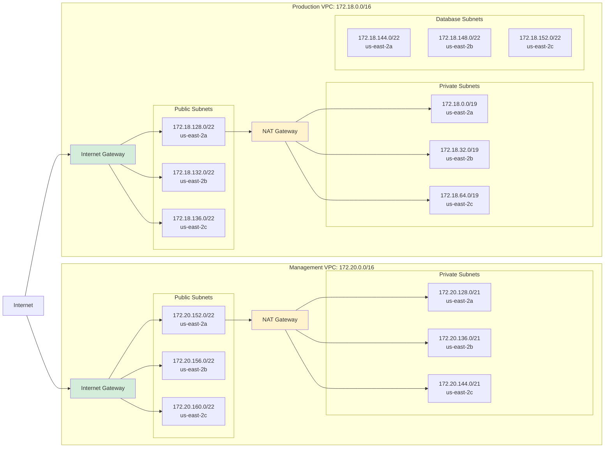
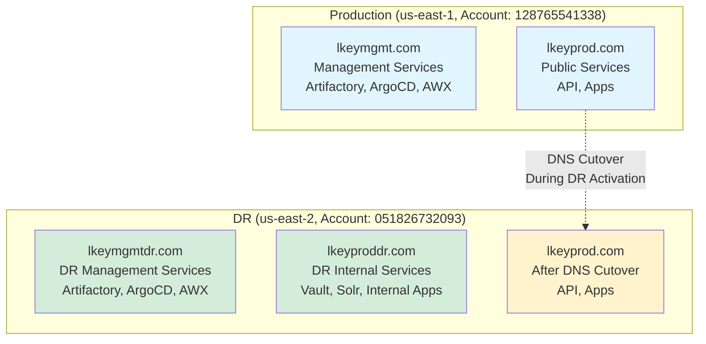
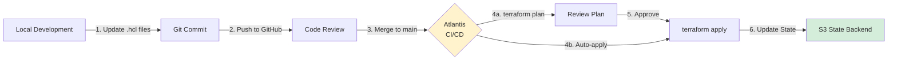

# DR Terraform Infrastructure Documentation

> Complete inventory of Terraform/Terragrunt managed DR infrastructure in us-east-2

## Table of Contents

- [Overview](#overview)
- [Terraform Repository Structure](#terraform-repository-structure)
- [Infrastructure Components](#infrastructure-components)
- [Network Architecture](#network-architecture)
- [Management Environment](#management-environment)
- [Production Environment](#production-environment)
- [Domain Strategy](#domain-strategy)
- [Deployment Workflow](#deployment-workflow)

---

## Overview

All DR infrastructure in AWS account **051826732093** (us-east-2) is managed via Terraform/Terragrunt located at:

```
Repository: /home/mmasseo/gitstuff/terraform
DR Path: lk/aws/us-east-2/
```

### Key Configuration

| Setting | Value |
|---------|-------|
| **AWS Account** | 051826732093 |
| **Region** | us-east-2 |
| **AWS Profile** | `production_dr` |
| **Terraform State** | S3 bucket (separate for mgmt and prod) |
| **IaC Tool** | Terragrunt (Terraform wrapper) |

---

## Terraform Repository Structure

```
/home/mmasseo/gitstuff/terraform/
└── lk/aws/us-east-2/
    ├── region.hcl                     # Region-level configuration
    ├── mgmt/                          # Management environment (172.20.0.0/16)
    │   ├── environment.hcl            # Mgmt environment config
    │   ├── vpc/                       # use2-mgmt-vpc-shared
    │   ├── domain-controllers/        # Active Directory DCs
    │   ├── jfrog-resources/           # Artifactory RDS (db.r5.xlarge)
    │   ├── acm-certificates/          # SSL certificates
    │   ├── acm-certificates-artifactory/  # Artifactory-specific certs
    │   ├── hosted-dns-zones/          # lkeymgmtdr.com zone
    │   ├── iam-roles-profiles/        # IAM roles for mgmt
    │   ├── kms/                       # KMS encryption keys
    │   ├── key-pairs/                 # SSH key pairs
    │   ├── mgmt-security-groups/      # Security groups
    │   ├── sdm-gateway/               # StrongDM gateway
    │   ├── transit-gateway/           # TGW (on hold)
    │   ├── zscaler/                   # Zscaler cloud connector
    │   ├── zscaler-app-connector/     # Zscaler app connector
    │   ├── bootstrap-policies/        # Bootstrap IAM policies
    │   └── internal-dns/              # Route53 private zones
    │
    └── prod/                          # Production environment (172.18.0.0/16)
        ├── environment.hcl            # Prod environment config
        ├── vpc/                       # use2-prod-vpc-prod
        ├── acumatica/                 # Acumatica ERP
        ├── dna-dqs/                   # Data Quality Services
        ├── dna-sql/                   # DNA SQL Server
        ├── dna-tools/                 # DNA tools
        ├── dna-s3-buckets/            # DNA S3 storage
        ├── elasys/                    # Elasticsearch cluster
        ├── elasys-resources/          # Elasys supporting resources
        ├── fsx-file-share/            # FSx Windows file share
        ├── fsx-office-share/          # FSx office file share
        ├── latitude-app/              # Latitude application tier
        ├── latitude-db/               # Latitude database
        ├── latitude-lb/               # Latitude load balancer
        ├── latitude-web/              # Latitude web tier
        ├── latitude-resources/        # Latitude supporting resources
        ├── pti-app/                   # PTI application
        ├── pti-resources/             # PTI supporting resources
        ├── power-bi/                  # Power BI infrastructure
        ├── solr-cluster-v8/           # Solr search cluster v8
        ├── vault-integrated-storage/  # HashiCorp Vault (3 node cluster)
        ├── diplomat/                  # Diplomat service
        ├── diplomat-s3/               # Diplomat S3 buckets
        ├── app-s3-buckets/            # Application S3 buckets
        ├── app-security-groups/       # Application security groups
        ├── acm-certificates/          # SSL certificates
        ├── hosted-dns-zones/          # lkeyproddr.com zone
        ├── iam-roles-profiles/        # IAM roles for prod
        ├── kms/                       # KMS encryption keys
        ├── key-pairs/                 # SSH key pairs
        ├── sdm-relay/                 # StrongDM relay (for prod access)
        ├── transit-gateway/           # TGW (on hold)
        ├── bootstrap-policies/        # Bootstrap IAM policies
        ├── internal-dns/              # Route53 private zones
        └── vpc-flowlog-iam/           # VPC flow log IAM roles
```

---

## Infrastructure Components

### Complete DR Infrastructure Diagram

```mermaid
graph TB
    subgraph "DR Account: 051826732093 (us-east-2)"
        subgraph "Management VPC (172.20.0.0/16)"
            subgraph "Management Services"
                MGMT_VPC[VPC: use2-mgmt-vpc-shared]
                DNS_MGMT[DNS: lkeymgmtdr.com]

                subgraph "Infrastructure Services"
                    ARTIFACTORY[Artifactory + RDS<br/>db.r5.xlarge PostgreSQL 13.10]
                    AD[Active Directory<br/>Domain Controllers]
                    SDM_GW[StrongDM Gateway]
                    ZSCALER[Zscaler<br/>Cloud Connect + App Connector]
                end

                subgraph "Supporting Services"
                    KMS_MGMT[KMS Keys]
                    ACM_MGMT[ACM Certificates]
                    IAM_MGMT[IAM Roles & Profiles]
                    SG_MGMT[Security Groups]
                    KEYS_MGMT[SSH Key Pairs]
                end
            end
        end

        subgraph "Production VPC (172.18.0.0/16)"
            subgraph "Production Services"
                PROD_VPC[VPC: use2-prod-vpc-prod]
                DNS_PROD[DNS: lkeyproddr.com]

                subgraph "Windows Applications"
                    ACUMATICA[Acumatica ERP]
                    DQS[DNA DQS<br/>Data Quality Services]
                    SQL[DNA SQL Server]
                    LATITUDE_APP[Latitude App]
                    LATITUDE_DB[Latitude Database]
                    LATITUDE_WEB[Latitude Web]
                    PTI[PTI Application]
                    POWERBI[Power BI]
                end

                subgraph "Data & Storage"
                    FSX1[FSx File Share<br/>Windows Storage]
                    FSX2[FSx Office Share]
                    ELASYS[Elasticsearch Cluster]
                    SOLR[Solr Cluster v8<br/>lkeyproddr.com]
                    S3_DNA[DNA S3 Buckets]
                    S3_APP[App S3 Buckets]
                    S3_DIPLOMAT[Diplomat S3]
                end

                subgraph "Infrastructure Services"
                    VAULT[HashiCorp Vault<br/>3-node m5.large cluster<br/>vault.lkeyproddr.com]
                    DIPLOMAT[Diplomat Service]
                    DNA_TOOLS[DNA Tools]
                end

                subgraph "Supporting Services"
                    SDM_RELAY[StrongDM Relay]
                    KMS_PROD[KMS Keys]
                    ACM_PROD[ACM Certificates]
                    IAM_PROD[IAM Roles & Profiles]
                    SG_PROD[Security Groups]
                    LB_LAT[Latitude Load Balancer]
                end
            end
        end

        subgraph "Shared Services"
            TGW[Transit Gateway<br/>Status: On Hold]
            TAILSCALE[Tailscale VPN<br/>Primary Access Method]
        end

        subgraph "Terraform State"
            TF_STATE_MGMT[S3: tf-state-dr-mgmt<br/>DynamoDB: tf-state-lock]
            TF_STATE_PROD[S3: tf-state-dr-prod<br/>DynamoDB: tf-state-lock]
        end
    end

    subgraph "External Access"
        USER[Platform Team]
        PROD_ACCOUNT[Production Account<br/>128765541338<br/>us-east-1]
    end

    USER -->|Tailscale VPN| TAILSCALE
    TAILSCALE -->|Access| MGMT_VPC
    TAILSCALE -->|Access| PROD_VPC

    PROD_ACCOUNT -.->|Clumio Backup| AD
    PROD_ACCOUNT -.->|Clumio Backup| FSX1
    PROD_ACCOUNT -.->|Clumio Backup| FSX2
    PROD_ACCOUNT -.->|S3 Replication| ARTIFACTORY

    TGW -.->|On Hold| MGMT_VPC
    TGW -.->|On Hold| PROD_VPC

    MGMT_VPC --> TF_STATE_MGMT
    PROD_VPC --> TF_STATE_PROD

    ARTIFACTORY --> DNS_MGMT
    AD --> DNS_MGMT

    VAULT --> DNS_PROD
    SOLR --> DNS_PROD
    ACUMATICA --> DNS_PROD

    style TAILSCALE fill:#d4edda
    style TGW fill:#f8d7da
    style ARTIFACTORY fill:#cfe2ff
    style VAULT fill:#cfe2ff
    style AD fill:#fff3cd
    style TF_STATE_MGMT fill:#e7f3ff
    style TF_STATE_PROD fill:#e7f3ff
```



---

## Network Architecture

### VPC Configuration



### Availability Zones

All DR infrastructure is deployed across 3 availability zones for high availability:

- **us-east-2a**
- **us-east-2b**
- **us-east-2c**

---

## Management Environment

### Management VPC (use2-mgmt-vpc-shared)

**CIDR:** 172.20.0.0/16

| Component | Type | Configuration | Terraform Path |
|-----------|------|---------------|----------------|
| **VPC** | Network | 172.20.0.0/16, 3 AZs | `mgmt/vpc/` |
| **Artifactory** | RDS PostgreSQL | db.r5.xlarge, v13.10 | `mgmt/jfrog-resources/` |
| **Active Directory** | EC2 | Domain Controllers | `mgmt/domain-controllers/` |
| **StrongDM Gateway** | EC2 | Access gateway | `mgmt/sdm-gateway/` |
| **Zscaler** | Network | Cloud Connect + App Connector | `mgmt/zscaler/` |
| **DNS Zone** | Route53 | lkeymgmtdr.com | `mgmt/hosted-dns-zones/` |
| **SSL Certificates** | ACM | *.lkeymgmtdr.com | `mgmt/acm-certificates/` |
| **KMS Keys** | Encryption | Data encryption | `mgmt/kms/` |
| **IAM Roles** | Identity | Service roles | `mgmt/iam-roles-profiles/` |
| **Security Groups** | Network | Access control | `mgmt/mgmt-security-groups/` |
| **SSH Keys** | Access | Key pairs | `mgmt/key-pairs/` |
| **Transit Gateway** | Network | On hold | `mgmt/transit-gateway/` |

### Management Environment Configuration

```hcl
# From: us-east-2/mgmt/environment.hcl
account_name    = "prod"
aws_profile     = "production_dr"
dns_zone_name   = "lkeymgmtdr"
environment     = "mgmt"

vpc_default_azs     = ["us-east-2a", "us-east-2b", "us-east-2c"]
vpc_default_name    = "use2-mgmt-vpc-shared"
vpc_private_subnets = ["172.20.128.0/21", "172.20.136.0/21", "172.20.144.0/21"]
vpc_public_subnets  = ["172.20.152.0/22", "172.20.156.0/22", "172.20.160.0/22"]
```

### Key Services

#### Artifactory (JFrog Resources)

**Configuration:**
- **Database:** PostgreSQL 13.10
- **Instance Type:** db.r5.xlarge
- **High Availability:** Multi-AZ RDS
- **Domain:** artifactory.lkeymgmtdr.com
- **Terraform:** `mgmt/jfrog-resources/`

**Purpose:** Stores Docker images, Helm charts, Maven artifacts, NPM packages, PyPI packages, and NuGet packages for DR environment.

#### Active Directory

**Configuration:**
- **Type:** EC2-based Domain Controllers
- **Backup:** Restored from Clumio
- **Terraform:** `mgmt/domain-controllers/`

**Purpose:** Provides domain authentication for Windows-based infrastructure.

---

## Production Environment

### Production VPC (use2-prod-vpc-prod)

**CIDR:** 172.18.0.0/16

### Windows Applications

| Application | Purpose | Terraform Path |
|-------------|---------|----------------|
| **Acumatica** | ERP System | `prod/acumatica/` |
| **DNA DQS** | Data Quality Services | `prod/dna-dqs/` |
| **DNA SQL** | SQL Server Database | `prod/dna-sql/` |
| **Latitude** | Multi-tier app (app/db/web/lb) | `prod/latitude-*/` |
| **PTI** | PTI Application | `prod/pti-app/` |
| **Power BI** | Business Intelligence | `prod/power-bi/` |

### Data & Storage Services

| Service | Type | Configuration | Terraform Path |
|---------|------|---------------|----------------|
| **FSx File Share** | Windows Storage | FSx for Windows | `prod/fsx-file-share/` |
| **FSx Office Share** | Windows Storage | FSx for Windows | `prod/fsx-office-share/` |
| **Elasticsearch** | Search/Analytics | Elasys cluster | `prod/elasys/`, `prod/elasys-resources/` |
| **Solr Cluster** | Search Platform | Solr v8 on lkeyproddr.com | `prod/solr-cluster-v8/` |
| **DNA S3 Buckets** | Object Storage | S3 buckets for DNA | `prod/dna-s3-buckets/` |
| **App S3 Buckets** | Object Storage | Application S3 storage | `prod/app-s3-buckets/` |
| **Diplomat S3** | Object Storage | Diplomat data storage | `prod/diplomat-s3/` |

### Infrastructure Services

#### HashiCorp Vault

**Configuration:**
- **Instance Type:** m5.large
- **Node Count:** 3 (HA cluster)
- **Storage:** Integrated storage (Raft)
- **Domain:** vault.lkeyproddr.com
- **Terraform:** `prod/vault-integrated-storage/`

**Purpose:** Secrets management and encryption for DR production workloads.

#### Diplomat Service

**Configuration:**
- **Type:** Application service
- **Terraform:** `prod/diplomat/`, `prod/diplomat-s3/`

**Purpose:** [Service purpose - not clear from config]

#### DNA Tools

**Configuration:**
- **Type:** Tooling infrastructure
- **Terraform:** `prod/dna-tools/`

### Production Environment Configuration

```hcl
# From: us-east-2/prod/environment.hcl
account_name    = "prod"
aws_profile     = "production_dr"
dns_zone_name   = "lkeyproddr"
environment     = "prod"
environment_dr  = "prod_dr"

vpc_cidr_dr         = "172.17.0.0/16"  # Additional CIDR
vpc_default_azs     = ["us-east-2a", "us-east-2b", "us-east-2c"]
vpc_default_name    = "use2-prod-vpc-prod"
vpc_database_subnets = ["172.18.144.0/22", "172.18.148.0/22", "172.18.152.0/22"]
vpc_private_subnets  = ["172.18.0.0/19", "172.18.32.0/19", "172.18.64.0/19"]
vpc_public_subnets   = ["172.18.128.0/22", "172.18.132.0/22", "172.18.136.0/22"]
```

---

## Domain Strategy

### Four-Domain Architecture



| Domain | Environment | Purpose | DNS Cutover Required |
|--------|-------------|---------|---------------------|
| **lkeymgmt.com** | Production Mgmt | Production management tools | No |
| **lkeymgmtdr.com** | DR Mgmt | DR management tools | No |
| **lkeyprod.com** | Production/DR | Public-facing services | Yes (during DR activation) |
| **lkeyproddr.com** | DR Prod | DR internal services (Vault, Solr, etc.) | No |

### Domain Usage

**lkeymgmtdr.com (Terraform managed):**
- Artifactory: artifactory.lkeymgmtdr.com
- ArgoCD: argocd.lkeymgmtdr.com
- AWX: awx.lkeymgmtdr.com
- Active Directory internal DNS

**lkeyproddr.com (Terraform managed):**
- Vault: vault.lkeyproddr.com
- Solr: solr.lkeyproddr.com
- Internal application services
- Windows application domains

**lkeyprod.com (DNS cutover during DR):**
- Kong API Gateway
- Public-facing applications
- Customer-facing services

---

## Deployment Workflow

### Terraform/Terragrunt Workflow



### Terraform State Management

**Management Environment:**
- **State Bucket:** Referenced as `tf_state_s3_bucket_dr_mgmt`
- **State Lock:** DynamoDB table for state locking
- **Region:** us-east-2
- **Profile:** `production_dr`

**Production Environment:**
- **State Bucket:** Referenced as `tf_state_s3_bucket_dr_prod`
- **State Lock:** DynamoDB table for state locking
- **Region:** us-east-2
- **Profile:** `production_dr`

### Applying Terraform Changes

```bash
# Navigate to specific component
cd /home/mmasseo/gitstuff/terraform/lk/aws/us-east-2/mgmt/vpc

# Ensure correct AWS profile
export AWS_PROFILE=production_dr

# Initialize Terragrunt (if needed)
terragrunt init

# Plan changes
terragrunt plan

# Apply changes (after review)
terragrunt apply

# View state
terragrunt state list
```

### Common Terragrunt Commands

```bash
# Plan all changes in a directory
terragrunt run-all plan

# Apply all changes (dangerous - use with caution)
terragrunt run-all apply

# Show current state
terragrunt show

# Import existing resource
terragrunt import <resource_type>.<resource_name> <aws_resource_id>

# Refresh state
terragrunt refresh

# Destroy resources (use with extreme caution)
terragrunt destroy
```

---

## Key Findings from Terraform Analysis

### 1. Comprehensive Infrastructure Coverage

All major DR components are managed via Terraform:
- ✅ VPC and networking
- ✅ DNS zones (Route53)
- ✅ SSL certificates (ACM)
- ✅ IAM roles and policies
- ✅ KMS encryption keys
- ✅ Security groups
- ✅ RDS databases (Artifactory)
- ✅ EC2 instances (AD, Vault, Windows apps)
- ✅ FSx file systems
- ✅ S3 buckets
- ✅ Load balancers

### 2. Notable Absences from Terraform

**Not in Terraform (likely managed elsewhere):**
- EKS clusters (mgmt-use2-eks-1, prod-eks-1)
- ArgoCD (deployed via Terraform into EKS?)
- AWX/Ansible (EC2 + Minikube, possibly manual)
- Kong API Gateway
- Application deployments (handled by ArgoCD)

### 3. High Availability Design

- Multi-AZ deployment (us-east-2a, 2b, 2c)
- Separate VPCs for management and production
- Database subnets isolated from application subnets
- NAT Gateways in public subnets
- Transit Gateway configured (on hold)

### 4. Security Architecture

- Separate IAM roles per environment
- KMS encryption for data at rest
- Security groups for network isolation
- Private subnets for most workloads
- StrongDM Gateway and Relay for access
- Zscaler integration for network security

---

## Maintenance and Updates

### Regular Maintenance Tasks

**Monthly:**
- Review Terraform state for drift
- Check for updates to Terraform modules
- Verify security group rules
- Review IAM policies

**Quarterly:**
- Update Terraform provider versions
- Review and optimize resource sizing
- Audit KMS key usage
- Review DNS zone records

**During DR Tests:**
- Verify all Terraform-managed resources
- Test infrastructure provisioning
- Validate network connectivity
- Check SSL certificate expiration

### Monitoring Terraform State

```bash
# Check for drift between actual infrastructure and state
cd /home/mmasseo/gitstuff/terraform/lk/aws/us-east-2/mgmt
terragrunt plan

# If drift detected, refresh state
terragrunt refresh

# View specific resource
terragrunt state show <resource_address>
```

---

## Related Documentation

- [Main DR README](../README.md)
- [Domain and Service Inventory](DR-Domain-Service-Inventory.md)
- [Quick Reference Guide](DR-Quick-Reference.md)
- [EKS Cluster Access](DR-EKS-Cluster-Access.md)
- [Testing Issues Log](DR-Testing-Issues-Log.md)

---

## Next Steps

### Infrastructure Improvements

1. **EKS Integration:** Add EKS clusters to Terraform management
2. **Transit Gateway:** Re-evaluate TGW connection to production
3. **Backup Automation:** Terraform module for Clumio policies
4. **Monitoring:** Add CloudWatch alarms via Terraform
5. **Cost Optimization:** Review instance sizing and reserved instances

### Documentation Updates

- Document EKS Terraform modules (when created)
- Add network flow diagrams
- Document disaster recovery runbook integration with Terraform
- Create Terraform troubleshooting guide

---

**Last Updated:** 2025-10-27
**Terraform Repository:** /home/mmasseo/gitstuff/terraform
**Maintained By:** Platform Engineering Team
